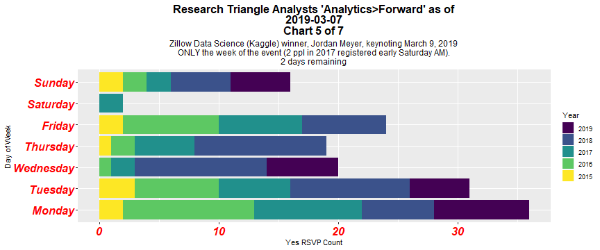
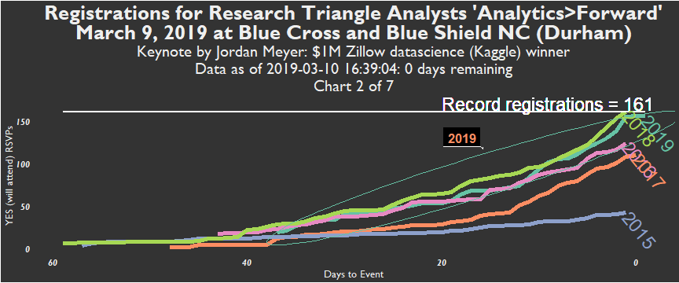
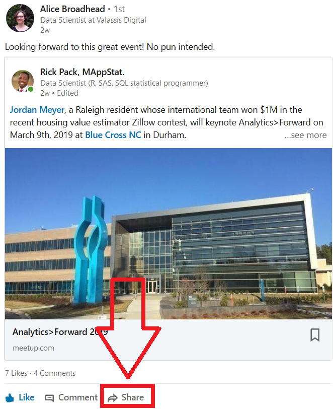

Analytics>Forward 2019
Marketing, collaboration, and data obsession
========================================================
author: Rick Pack
date: March 9, 2019
autosize: true


Registrations (rick use image 5)
====================================

***
Registrations stormed yesterday

- An obsession with marketing A>F grew from early Feb.
- LinkedIn, Facebook, Meetup, and Twitter were used
- Very few fliers were distributed
- This is a Xaringan (RStudio) presentation

I chase numbers part 1 - Track
========================================================


I chase numbers part 2 - Analytics>Forward
========================================================


I chase numbers part 3 - Analytics>Forward
========================================================


I chase collaboration
========================================================


Xan Gregg (JMP Software)
========================================================


Chuck Jaeger (Mr. Tableau / BI)
========================================================


Twitter-inspired ggplot2 experimentation
========================================================


```r
head(allAF_frm)
library(gapminder)
gapminder$year_factor <- as.factor(gapminder$year)
max_year <- max(gapminder$year)

gap_plot <-
ggplot(data = gapminder,
       aes(x = year,
           y = gdpPercap,
           colour = continent_factor)) +
  geom_line(size = 2) +
  geom_segment(aes(x = 0, y = max_gdp, xend = Inf, yend = max_gdp)) +
  ggforce::geom_mark_ellipse(aes(colour = continent_factor, label = yes_year_factor,
                                 filter = yes_year_factor == max_yes_year, con.cap = 0)) +
  scale_x_date(date_labels = "%b") +
  xlab("Month of year") +
  ylab("YES (will attend) RSVPs") +
  labs(colour = "Year") + 
  ggtitle(label = paste0("Research Triangle Analysts 'Analytics>Forward' Registrations as of\n",
                         Sys.Date()),
          subtitle = str_glue("Zillow Data Science (Kaggle) winner, Jordan Meyer", 
                              " keynoting March 9, 2019\n",
                              as.numeric(today_days_to_event), " days remaining\nChart 1 of 5")) +
  directlabels::geom_dl(aes(label = yes_year), method = list("last.points",rot = -50)) +
  theme(plot.title = element_text(hjust = 0.5, size = 16, lineheight = .8, face = "bold"),
        plot.subtitle = element_text(hjust = 0.5, size = 12),
        axis.text.x = element_text(face = "bold.italic", color = "red", size = 16),
        axis.text.y = element_text(face = "bold.italic", color = "red", size = 16)) +
  labs(colour = "Year") + 
  # http://colorbrewer2.org/#type=qualitative&scheme=Set2&n=5
  scale_colour_manual(values = c("#66c2a5", "#fc8d62", "#8da0cb", "#e78ac3", "#a6d854")) +
  NULL
```

Twitter-inspired ggplot2 experimentation
========================================================
print(gap_plot)

Thank you Hadley Wickham
========================================================


Data and code on AnalyticsForward_2019 Github
========================================================

```r
knitr::kable(print(head(allAF_frm_weekday)))
```

Data and code on AnalyticsForward_2019 Github
========================================================

```r
# https://evamaerey.github.io/ggplot_flipbook/ggplot_flipbook_xaringan.html#4
# https://github.com/EvaMaeRey/ggplot_flipbook
weekday_plot <-
ggplot(data = allAF_frm_weekday,
       aes(y = rsvp_yes_cumsum_weekday,
           x = yes_weekday_factor,
           fill = yes_year_factor)) +
  aes(x = yes_weekday_factor) + 
  labs(x = "Day of Week") +
  aes(y = rsvp_yes_cumsum_weekday) +
  labs(y = "Yes RSVP Count") +
  geom_bar(position = "stack", stat = "identity") +
  labs(fill = "Year") + 
  coord_flip() + 
  scale_fill_viridis_d() +
  ggtitle(label = paste0("Research Triangle Analysts 'Analytics>Forward' as of\n",
                         Sys.Date(), "\nChart 3 of 7"),
          subtitle = str_glue("Zillow Data Science (Kaggle) winner, Jordan Meyer,", 
                              " keynoting March 9, 2019\nAll weeks shown.\n",
                              as.numeric(today_days_to_event), " days remaining")) +
  theme(plot.title = element_text(hjust = 0.5, size = 16, lineheight = .8, face = "bold"),
        plot.subtitle = element_text(hjust = 0.5, size = 12),
        axis.text.x = element_text(face = "bold.italic", color = "red", size = 16),
        axis.text.y = element_text(face = "bold.italic", color = "red", size = 16))
```

Data and code on AnalyticsForward_2019 Github
========================================================
print(weekday_plot")
