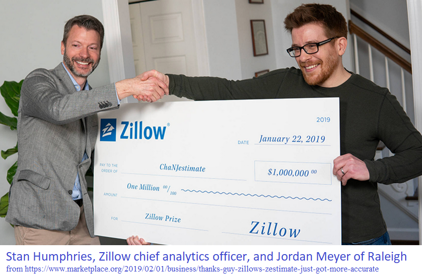
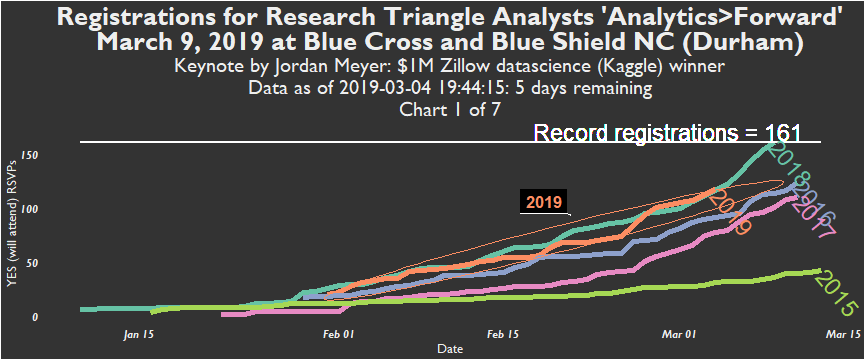
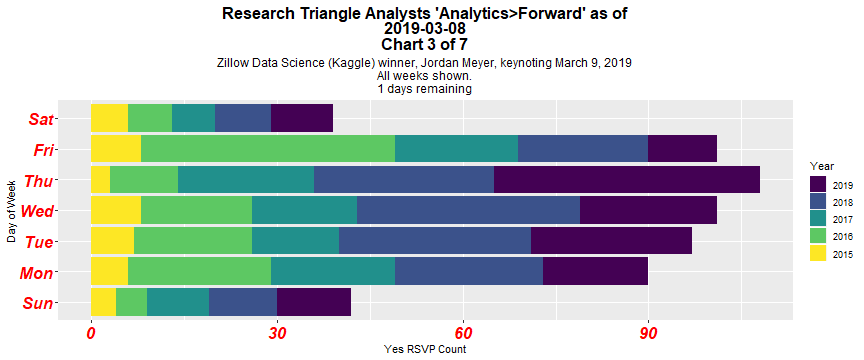
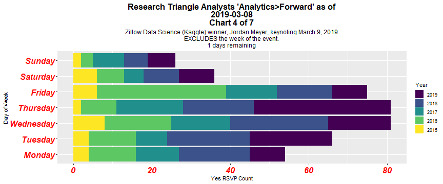

```{r setup, include=FALSE, cache = FALSE, echo = FALSE}
knitr::opts_chunk$set(echo = FALSE)
## Save images and CSV data files locally?
save_to_folder <- TRUE
## If TRUE, where to save?
folder_save <- "C:/Users/rick2/Downloads/R/AnalyticsForward_2019/"
####################################
## If need to use github CSV file ##
## rather than use Meetup API     ##
####################################
github_file <- FALSE
## Notice need for raw.
github_filename <- stringr::str_glue(
                            'https://raw.githubusercontent.com/RickPack/Analytics',
                            'Forward_2019/master/AnalyticsForward_2019_02_28_AM.csv')

# Get your Meetup key by going to
  # https://secure.meetup.com/meetup_api/key/
  # Sys.setenv(MEETUP_KEY = "NOT_SHOWN")
  
  # What is the Meetup group name?
  # Find this in the Meetup URL.
  # For example, in https://www.meetup.com/Research-Triangle-Analysts/events/258165094/
  # it is:
  # 'Research-Triangle-Analysts'
  meetupgrp_name <- 'Research-Triangle-Analysts'

###################################
## If using the API, save files  ##
## with AM or PM (or anything)   ##
## suffix?                       ##
###################################
AMPM <- "AM"

source('Meetup_RSVP_Yes_latest.R')

```

# "Analytics>Forward" (2019) - 5th annual unconference by Research Triangle Analysts

"Pitch a talk, hear some talks" #AnalyticsForward http://bit.ly/AF2019Signup

This page's data visualizations will be updated daily.

They primarily depict Meetup registrations for Analytics>Forward, with the purpose of indicating sell-out potential and to help the planning comittee with elements including the catering order.

Thank you to R-Ladies for the meetupr package.

## Keynote


## Charts








```{r highchart1}
#print(grp_plot)
```


```{r highchart2}
#print(grp_plot_latestyear)
```

## Total Registrations for Analytics>Forward per year
```{r tables}
library(dplyr)
knitr::kable(allAF_frm %>% group_by(yes_year) %>% 
  dplyr::filter(dates_yes == max(dates_yes)) %>%
  select(name, yes_year, dates_yes_cumsum))
```