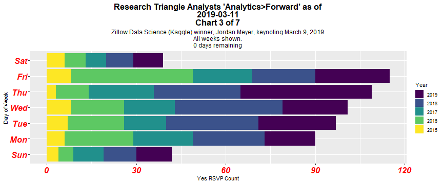

```{r setup, include=FALSE, cache = FALSE, echo = FALSE}
knitr::opts_chunk$set(echo = FALSE)

################################################
## Get your Meetup key by going to            ##
## https://secure.meetup.com/meetup_api/key/  ##
## !!!    Then must run the line below!  !!!  ##
################################################
## Sys.setenv(MEETUP_KEY = "NOT_SHOWN")       ##
################################################

## Save images and CSV data files locally?
save_to_folder <- TRUE
## If TRUE, where to save?
folder_save <- "C:/Users/rick2/Downloads/R/AnalyticsForward_2019/"
####################################
## If need to use github CSV file ##
## rather than use Meetup API     ##
####################################
github_file <- FALSE

# What is the Meetup group name?
# Find this in the Meetup URL.
# For example, in https://www.meetup.com/Research-Triangle-Analysts/events/258165094/
# it is:
# 'Research-Triangle-Analysts'
meetupgrp_name <- 'Research-Triangle-Analysts'


source('Meetup_RSVP_Yes_latest.R')
lst_out <- Meetup_RSVP_Yes_Count(save_to_folder, github_file, meetupgrp_name, folder_save)
allAF_frm <- lst_out[[1]]
allAF_frm_weekday <- lst_out[[2]]
allAF_frm_dt_all <- lst_out[[6]]

allAF_frm <- 
  allAF_frm %>% 
  rename(Year = yes_year, 
         Registration_Count = rsvp_yes_count,
         Registration_CumSum = dates_yes_cumsum,
         Registration_Date = dates_yes) %>% 
  mutate(Weekday = wday(ymd(Registration_Date), label = TRUE)) %>% 
  select(name, Year, Registration_Date, Weekday, Registration_Count,
         Registration_CumSum, Registration_Date,
         event_date, days_to_event)

max_yes_year <- max(allAF_frm$Year)

today_days_to_event      <- allAF_frm %>%
    dplyr::filter(Year == max_yes_year) %>%
    mutate(min_days_event = min(days_to_event)) %>%
    distinct(min_days_event) %>%
    pull(min_days_event)

weeks_until_event <- as.numeric(floor(today_days_to_event / 7))

```

# "Analytics>Forward" (2019) - 5th annual unconference by Research Triangle Analysts

"Pitch a talk, hear some talks, eat good food" #AnalyticsForward http://bit.ly/AF2019Signup

This page's data visualizations will be updated daily.

They primarily depict Meetup Registrations for Analytics>Forward, with the purpose of indicating sell-out potential and to help the planning comittee with elements including the catering order.

Thank you to R-Ladies for the meetupr package.

## Keynote


## Charts





```{r highchart1}
#print(grp_plot)
```


```{r highchart2}
#print(grp_plot_latestyear)
```

## Week of event average Registrations per day 

### Prior to the current year and after 2015 (first year, lower Registrations)

```{r table_notcur}
allAF_frm_dt_all_big_years_not_current <-
  allAF_frm_dt_all %>% 
  dplyr::filter(yes_year > 2015 & yes_year < max_yes_year)

allAF_frm_dt_all_big_years_not_current_weekday <-
  allAF_frm_dt_all_big_years_not_current %>% 
    dplyr::filter(yes_year > 2015 & yes_year < max_yes_year) %>% 
    dplyr::filter(days_to_event <= 6 * (weeks_until_event + 1) + min(weeks_until_event, 1) &
                    days_to_event >= 6 * (weeks_until_event + 1) + min(weeks_until_event, 1) - 6) %>% 
    mutate(hour_rsvp = hour(datetime_rsvp),
           weekday_rsvp = wday(ymd_hms(datetime_rsvp), label = TRUE)) %>% 
    group_by(weekday_rsvp) %>% 
    summarise(Average_RSVP_weekday = n() /   
              length(unique(allAF_frm_dt_all_big_years_not_current$yes_year)))

knitr::kable(allAF_frm_dt_all_big_years_not_current_weekday)
```

### Current year 

```{r table_curyear}
allAF_frm_dt_all_current <-
  allAF_frm_dt_all %>% 
  dplyr::filter(yes_year == 2019)

allAF_frm_dt_all_current_year_weekday <-
  allAF_frm_dt_all_current %>% 
    dplyr::filter(yes_year == max_yes_year) %>% 
    dplyr::filter(days_to_event <= 6 * (weeks_until_event + 1) + min(weeks_until_event, 1) &
                    days_to_event >= 6 * (weeks_until_event + 1) + min(weeks_until_event, 1) - 6) %>% 
    mutate(hour_rsvp = hour(datetime_rsvp),
           weekday_rsvp = wday(ymd_hms(datetime_rsvp), label = TRUE)) %>% 
    group_by(weekday_rsvp) %>% 
    summarise(RSVP_weekday = n())

knitr::kable(allAF_frm_dt_all_current_year_weekday)
```

## Highest Performing Days (Registrations)

### All years - 5 Highest Performing Days
```{r table_high_all_years}
high_all_years <- allAF_frm %>% 
  ungroup() %>% 
  top_n(5, Registration_Count) %>% 
  arrange(desc(Registration_Count))
knitr::kable(high_all_years %>% 
             select(name, Registration_Date, Weekday, Registration_Count))
```

### Current year - 5 Highest Performing Days
```{r table_high_cur_year}
high_cur_year <- allAF_frm %>% 
  ungroup() %>% 
  dplyr::filter(Year == max_yes_year) %>% 
  top_n(5, Registration_Count) %>% 
  arrange(desc(Registration_Count))
knitr::kable(high_cur_year %>% 
             select(name, Registration_Date, Weekday, Registration_Count))
```

## Total Registrations for Analytics>Forward per year
```{r table_peryear}
library(dplyr)
print(paste("As of ", Sys.time()))
knitr::kable(allAF_frm %>% group_by(Year) %>% 
  dplyr::filter(Registration_Date == max(Registration_Date)) %>% 
  rename(Total_Registrations = Registration_CumSum) %>% 
  ungroup() %>% 
  select(name, Year, Total_Registrations))
```

# Current Year Analytics>Forward Registration Link
[Current Year Meetup Link](http://bit.ly/AF2019Signup "Analytics>Forward 2019 Meetup page")