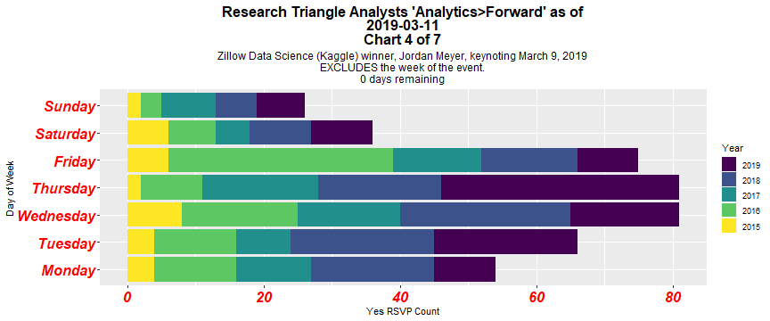
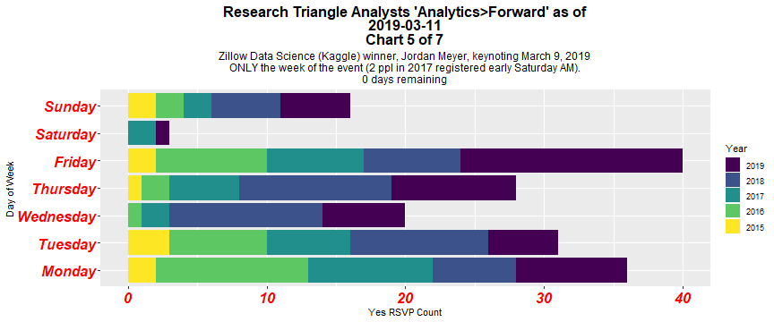
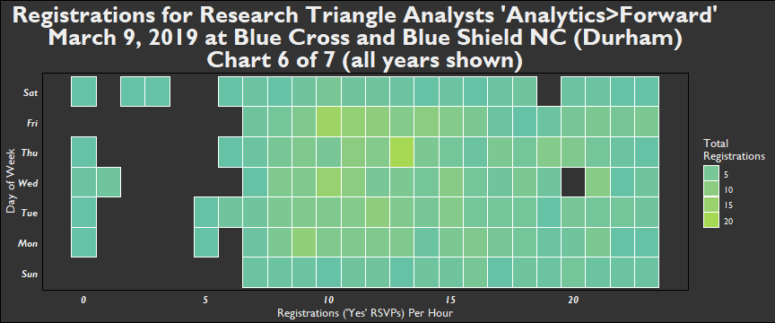
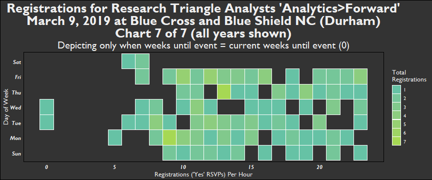

"Analytics&gt;Forward" (2019) - 5th annual unconference by Research Triangle Analysts
=====================================================================================

"Pitch a talk, hear some talks, eat good food" \#AnalyticsForward <http://bit.ly/AF2019Signup>

This page's data visualizations will be updated daily.

They primarily depict Meetup Registrations for Analytics&gt;Forward, with the purpose of indicating sell-out potential and to help the planning comittee with elements including the catering order.

Thank you to R-Ladies for the meetupr package.

Keynote
-------

Charts
------

      

Week of event average Registrations per day
-------------------------------------------

### Prior to the current year and after 2015 (first year, lower Registrations)

| weekday\_rsvp |  Average\_RSVP\_weekday|
|:--------------|-----------------------:|
| Sun           |               3.0000000|
| Mon           |               8.3333333|
| Tue           |               7.6666667|
| Wed           |               4.3333333|
| Thu           |               6.0000000|
| Fri           |               7.3333333|
| Sat           |               0.6666667|

### Current year

| weekday\_rsvp |  RSVP\_weekday|
|:--------------|--------------:|
| Sun           |              5|
| Mon           |              6|
| Tue           |              5|
| Wed           |              6|
| Thu           |              7|
| Fri           |              1|

Highest Performing Days (Registrations)
---------------------------------------

### All years - 5 Highest Performing Days

| name                                                                  | Registration\_Date | Weekday |  Registration\_Count|
|:----------------------------------------------------------------------|:-------------------|:--------|--------------------:|
| Analytics&gt;Forward 2019                                             | 2019-01-31         | Thu     |                   19|
| Analytics&gt;Forward, with Keynote by John Sall, EVP of SAS Institute | 2016-01-29         | Fri     |                   17|
| Analytics&gt;Forward, with Keynote by John Sall, EVP of SAS Institute | 2016-02-26         | Fri     |                   11|
| Analytics&gt;Forward, with Keynote by John Sall, EVP of SAS Institute | 2016-03-07         | Mon     |                   11|
| Analytics&gt;Forward 2018                                             | 2018-03-07         | Wed     |                   11|
| Analytics&gt;Forward 2018                                             | 2018-03-08         | Thu     |                   11|

### Current year - 5 Highest Performing Days

| name                      | Registration\_Date | Weekday |  Registration\_Count|
|:--------------------------|:-------------------|:--------|--------------------:|
| Analytics&gt;Forward 2019 | 2019-01-31         | Thu     |                   19|
| Analytics&gt;Forward 2019 | 2019-02-26         | Tue     |                   10|
| Analytics&gt;Forward 2019 | 2019-02-27         | Wed     |                    9|
| Analytics&gt;Forward 2019 | 2019-03-07         | Thu     |                    9|
| Analytics&gt;Forward 2019 | 2019-02-28         | Thu     |                    8|
| Analytics&gt;Forward 2019 | 2019-03-04         | Mon     |                    8|

Total Registrations for Analytics&gt;Forward per year
-----------------------------------------------------

    ## [1] "As of  2019-03-08 08:10:18"

| name                                                                  |  Year|  Total\_Registrations|
|:----------------------------------------------------------------------|-----:|---------------------:|
| Analytics Forward - An Unconference                                   |  2015|                    42|
| Analytics&gt;Forward, with Keynote by John Sall, EVP of SAS Institute |  2016|                   124|
| Analytics&gt;Forward                                                  |  2017|                   110|
| Analytics&gt;Forward 2018                                             |  2018|                   161|
| Analytics&gt;Forward 2019                                             |  2019|                   141|

Current Year Analytics&gt;Forward Registration Link
===================================================

[Current Year Meetup Link](http://bit.ly/AF2019Signup "Analytics>Forward 2019 Meetup page")
