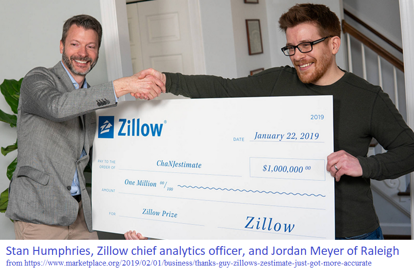

"Analytics&gt;Forward" (2019) - 5th annual unconference by Research Triangle Analysts
=====================================================================================

"Pitch a talk, hear some talks" \#AnalyticsForward <http://bit.ly/AF2019Signup>

This page's data visualizations will be updated daily.

They primarily depict Meetup registrations for Analytics&gt;Forward, with the purpose of indicating sell-out potential and to help the planning comittee with elements including the catering order.

Thank you to R-Ladies for the meetupr package.

Keynote
-------

Charts
------

      

Total Registrations for Analytics&gt;Forward per year
-----------------------------------------------------

    ## [1] "As of  2019-03-06 07:43:02"

| name                                                                  | Year |  Registration\_Count|
|:----------------------------------------------------------------------|:-----|--------------------:|
| Analytics Forward - An Unconference                                   | 2015 |                   42|
| Analytics&gt;Forward, with Keynote by John Sall, EVP of SAS Institute | 2016 |                  124|
| Analytics&gt;Forward                                                  | 2017 |                  110|
| Analytics&gt;Forward 2018                                             | 2018 |                  161|
| Analytics&gt;Forward 2019                                             | 2019 |                  126|
