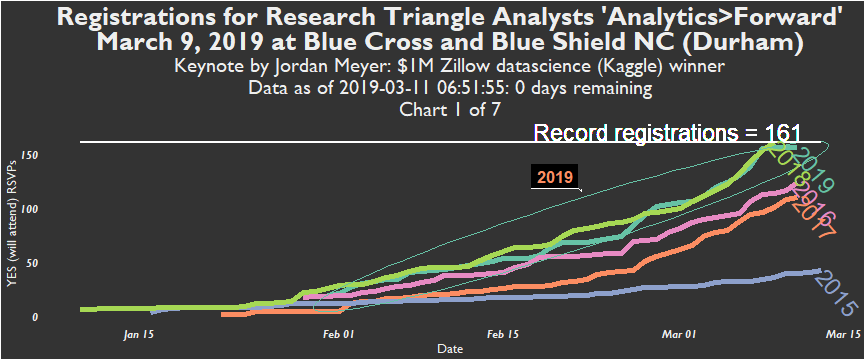

"Analytics&gt;Forward" (2019) - 5th annual unconference by Research Triangle Analysts
-------------------------------------------------------------------------------------

"Pitch a talk, hear some talks" \#AnalyticsForward <http://bit.ly/AF2019Signup>

``` r
print(p1)
```


``` r
print(p2)
```


``` r
print(p3)
```


``` r
print(p4)
```


``` r
print(p5)
```


Charts
------

    

``` r
#print(grp_plot)
```

``` r
#print(grp_plot_latestyear)
```

Total Registrations for Analytics&gt;Forward per year
-----------------------------------------------------

``` r
print(ls())
```

    ##  [1] "AF_events"                      "AF_events_dates_yes"           
    ##  [3] "AF15_frm"                       "AF15_id"                       
    ##  [5] "AF16_frm"                       "AF16_id"                       
    ##  [7] "AF17_frm"                       "AF17_id"                       
    ##  [9] "AF18_frm"                       "AF18_id"                       
    ## [11] "AF19_frm"                       "AF19_id"                       
    ## [13] "allAF_frm"                      "allAF_frm_rladies"             
    ## [15] "allAF_frm_weekday"              "allAF_frm_weekday_not_lastweek"
    ## [17] "allAF_frm_weekday_penult_week"  "allRTA_events"                 
    ## [19] "allRTA_events_future"           "allRTA_events_past"            
    ## [21] "AMPM"                           "animation"                     
    ## [23] "folder_save"                    "github_file"                   
    ## [25] "github_filename"                "grp_members"                   
    ## [27] "grp_members2"                   "grp_plot"                      
    ## [29] "grp_plot_latestyear"            "img"                           
    ## [31] "meetup_yes_RSVPs"               "meetupgrp_name"                
    ## [33] "p1"                             "p2"                            
    ## [35] "p3"                             "p4"                            
    ## [37] "p5"                             "save_to_folder"                
    ## [39] "today_days_to_event"            "today_relative_yes_count"      
    ## [41] "todaydt"

``` r
library(dplyr)
```

    ## 
    ## Attaching package: 'dplyr'

    ## The following objects are masked from 'package:stats':
    ## 
    ##     filter, lag

    ## The following objects are masked from 'package:base':
    ## 
    ##     intersect, setdiff, setequal, union

``` r
knitr::kable(allAF_frm %>% group_by(yes_year) %>% 
  dplyr::filter(dates_yes == max(dates_yes)) %>%
  select(id_name, yes_year, dates_yes_cumsum))
```

| id\_name |  yes\_year|  dates\_yes\_cumsum|
|:---------|----------:|-------------------:|
| AF15     |       2015|                  42|
| AF16     |       2016|                 124|
| AF17     |       2017|                 110|
| AF18     |       2018|                 161|
| AF19     |       2019|                 102|
